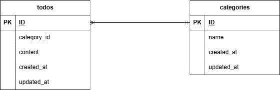

# Todoアプリ

Todoの登録・参照・更新・削除と検索機能を備えた、タスク管理ツールです。

## 環境構築

#### リポジトリをクローン

```
git clone git@github.com:haru-school-task/Todo-3.git
```

#### Laravelのビルド

（初回やソースコード変更時に実行します。フロントエンドのビルドも自動で行われます）
```
docker-compose up -d --build
```

### Laravel パッケージのインストールとデータベースの設定
（コンテナを起動した状態で、phpコンテナ内に入って操作を行います）

#### phpコンテナの中に入る

```
docker-compose exec php bash
```
#### コンテナ内でパッケージをインストール

```
composer install
```

#### .env ファイルの作成

```
cp .env.example .env
```

#### .env ファイルの修正

```
DB_DATABASE=（データベース名）
DB_USERNAME=（ユーザー名）
DB_PASSWORD=（パスワード）
```

#### キー生成

```
php artisan key:generate
```

#### マイグレーション・シーディングを実行

```
php artisan migrate --seed
```

#### 作業が終わったらコンテナから抜ける

```
exit
```

## 使用技術（実行環境）

フレームワーク：Laravel 8.75 / Fortify 1.x

言語：PHP 8.0.x / JavaScript

Webサーバー：Nginx 1.21

データベース：MySQL 8.0.26

## ER図



## URL

アプリケーション：http://localhost/

管理画面：http://localhost/login

phpMyAdmin：http://localhost:8080/


